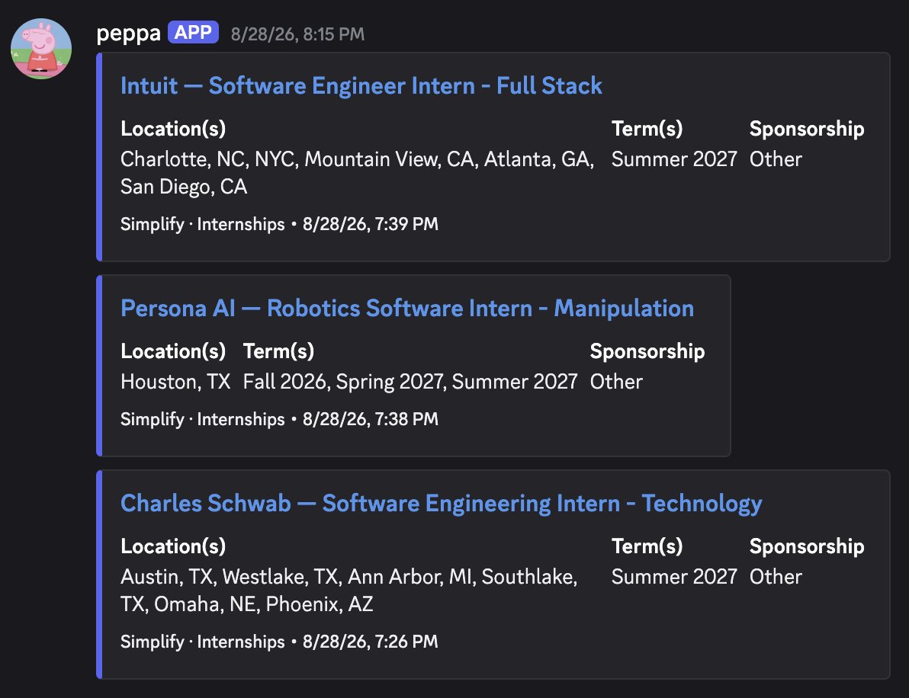

# Discord For Simplify Jobs

[](https://discord.gg/RRpXJZjxhM)

An automation that watches the Simplify Jobs [internship](https://github.com/SimplifyJobs/Summer2027-Internships) and [new-grad](https://github.com/SimplifyJobs/New-Grad-Positions) listings, and posts new ones to Discord — sorted into channels by category (Software, Product, Data Science/AI/ML, Quant, Hardware).

<p align="center">
  
</p>

## How it works

Every 15 minutes, [cron-job.org](https://cron-job.org) hits a small API endpoint hosted on Vercel. That endpoint triggers this repo's GitHub Actions workflow, which runs the script. This project initially used a GitHub Actions cron schedule, but that was removed because GitHub Actions cron jobs are not guaranteed to run on time.


The script does the following:

1. Fetches the latest listings from Simplify's internship and new-grad repos.
2. Compares them against seen job listings stored in the `data` directory.
3. Posts each new listing as a Discord embed to the webhook for its category.
4. Saves the updated list of seen jobs to the `data` directory and commits it back to the repo.

## Setup

To run your own copy, fork this repo and follow the steps below. The fork includes the existing `data/seen_ids` files, so it starts from the already-posted listing state checked into the repo.

### 1. Set Discord webhook secrets for GitHub Actions

Create one [Discord webhook](https://support.discord.com/hc/en-us/articles/228383668-Intro-to-Webhooks) for each channel/category you want to post to, then set the webhook URLs as GitHub Actions secrets on your fork — the workflow reads them from `secrets.<NAME>` (see [check-internships.yml](.github/workflows/check-internships.yml)).

The workflow supports these secrets:

- `SOFTWARE_INTERNSHIPS_WEBHOOK_URL`
- `PRODUCT_MANAGEMENT_INTERNSHIPS_WEBHOOK_URL`
- `DATA_SCIENCE_ML_AI_INTERNSHIPS_WEBHOOK_URL`
- `QUANTITATIVE_FINANCE_INTERNSHIPS_WEBHOOK_URL`
- `HARDWARE_INTERNSHIPS_WEBHOOK_URL`
- `UNCATEGORIZED_INTERNSHIPS_WEBHOOK_URL`
- `OFFSEASON_SOFTWARE_INTERNSHIPS_WEBHOOK_URL`
- `OFFSEASON_PRODUCT_MANAGEMENT_INTERNSHIPS_WEBHOOK_URL`
- `OFFSEASON_DATA_SCIENCE_ML_AI_INTERNSHIPS_WEBHOOK_URL`
- `OFFSEASON_QUANTITATIVE_FINANCE_INTERNSHIPS_WEBHOOK_URL`
- `OFFSEASON_HARDWARE_INTERNSHIPS_WEBHOOK_URL`
- `OFFSEASON_UNCATEGORIZED_INTERNSHIPS_WEBHOOK_URL`
- `FULLTIME_SOFTWARE_WEBHOOK_URL`
- `FULLTIME_PRODUCT_MANAGEMENT_WEBHOOK_URL`
- `FULLTIME_DATA_SCIENCE_ML_AI_WEBHOOK_URL`
- `FULLTIME_QUANTITATIVE_FINANCE_WEBHOOK_URL`
- `FULLTIME_HARDWARE_WEBHOOK_URL`
- `FULLTIME_UNCATEGORIZED_WEBHOOK_URL`

You don't need all 18 — if you leave a category's secret unset, matching listings are just skipped and retried on the next run. Only set webhooks for the categories/channels you actually want.

You can add these one at a time in the GitHub UI, or all at once with the bulk-add script below.

#### Option A: Add secrets one at a time (GitHub UI)

In your fork, go to **Settings -> Secrets and variables -> Actions -> New repository secret**, and add each webhook URL under the exact name from the list above (e.g. name = `SOFTWARE_INTERNSHIPS_WEBHOOK_URL`, secret = the Discord webhook URL). Repeat for every category you want.

#### Option B: Bulk-add secrets with the included script

[`github-secrets-bulk-add.sh`](github-secrets-bulk-add.sh) reads a `.env` file line by line and runs `gh secret set` for each `KEY=value` pair, so you can set every webhook secret in one go instead of clicking through the UI 18 times.

1. Install the [GitHub CLI](https://cli.github.com/) and log in: `gh auth login`.
2. Clone **your fork** (not the upstream repo) and `cd` into it — the script has no `--repo` flag, so it uploads secrets to whatever repo your local clone's `origin` remote points to.
3. Copy the template and fill in the webhook URLs you have: `cp example.env .env`. Leave unused webhook lines blank; the script skips empty lines.
4. Run the script: `./github-secrets-bulk-add.sh`. For every non-comment, non-blank line it prints `Setting secret: <KEY>` and uploads that value as a GitHub Actions secret with the same name.

`example.env` also has `CRON_SECRET` and `SIMPLIFY_DISCORD_REPO_WORKFLOW_DISPATCH` lines — those two are for the Vercel deployment in step 3, not the GitHub Actions workflow. The script will upload them as GitHub secrets too if you fill them in now, which is harmless (unused secrets are just ignored by the workflow), but you can leave them blank here and set them in Vercel later instead.

Your `.env` is already listed in [.gitignore](.gitignore), so it won't get committed — but since the script uploads every value in the file verbatim, only ever run it against a `.env` you created yourself.

### 2. Create a workflow dispatch token

The Vercel endpoint needs a GitHub token so it can call GitHub's workflow dispatch API. Create a fine-grained personal access token:

1. Go to GitHub -> Settings -> Developer settings -> Personal access tokens -> Fine-grained tokens.
2. Create a token with access to your fork of this repo.
3. Grant repository permission: Actions -> Read and write.
4. Copy the token value for the Vercel environment variable below.

GitHub documents this permission requirement in its [workflow dispatch API docs](https://docs.github.com/en/rest/actions/workflows#create-a-workflow-dispatch-event).

### 3. Deploy the trigger endpoint to Vercel

Import your fork into Vercel ([vercel.com/new](https://vercel.com/new)) so it deploys `api/index.py` as a Python serverless function. Then configure these Vercel environment variables:

- `CRON_SECRET`: a long random string. cron-job.org must send this as `Authorization: Bearer <CRON_SECRET>`.
- `SIMPLIFY_DISCORD_REPO_WORKFLOW_DISPATCH`: the fine-grained GitHub personal access token from step 2.

Generate a `CRON_SECRET` with:

```sh
openssl rand -hex 32
```

If you fork the project, also update `REPO` in `api/index.py` to point at your GitHub repo. It dispatches against the `main` branch (`json={"ref": "main"}`), so update that too if your fork's default branch is named differently.

### 4. Schedule cron-job.org

Create a cron-job.org job that runs every 15 minutes:

- Method: `POST`
- URL: `https://<your-vercel-project>.vercel.app/api/trigger`
- Header: `Authorization: Bearer <CRON_SECRET>`

You can verify the deployment with:

```sh
curl https://<your-vercel-project>.vercel.app/api/health
```

At this point, you are essentially done setting up the project. New job postings will appear in the Discord channels for the webhook secrets you set.

## Credit and license

This automation is powered by listings from [Simplify](https://simplify.jobs/) and the public Simplify Jobs repos for [internships](https://github.com/SimplifyJobs/Summer2027-Internships) and [new-grad roles](https://github.com/SimplifyJobs/New-Grad-Positions).

This project is licensed under the MIT License. See [LICENSE](LICENSE) for details. Simplify's listings are not covered by this project's license; the upstream listing repos do not currently publish a `LICENSE` file or a GitHub-detected license.
